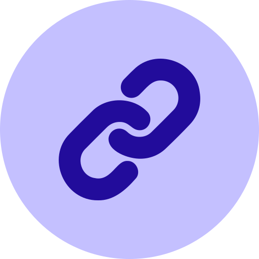
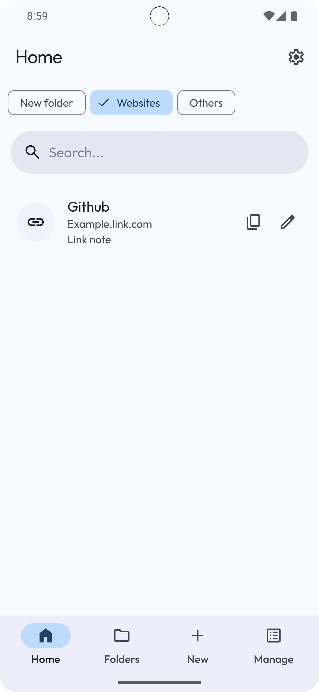
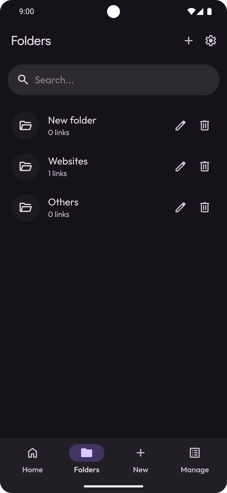
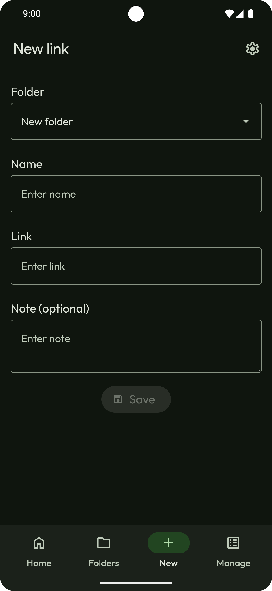
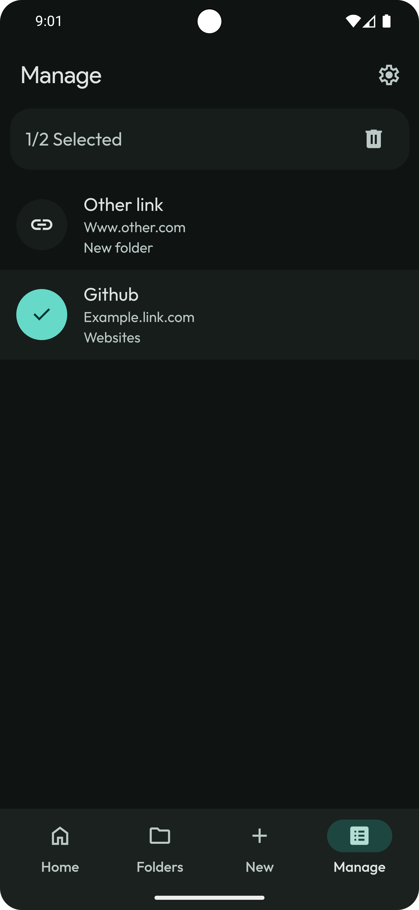
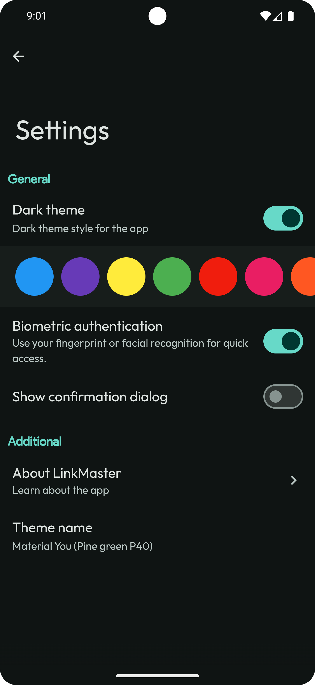

 # LinksMaster 
 

LinksMaster is developed with pure HTML, CSS, JavaScript, and Java. Designed to mimic the look and feel of a native Android app.

# 👁️ Preview

| Home |                                                                                                      Folders|                                                                                           Add links|  
| :---: |                                                                                                    :---: |                                                                                                     :---: |             
|  |   |    |  

| Manage links |                                                          Settings |                                                               
| :---: |                                                              :---: |                                                                                                                                        
|  |      |                                                                                                                                                                   

 

# 📲 Download

    

# ✨ Features:

- 🌐 **Save Links:** Easily save your favorite links to access them later.
- 📝 **Add Notes & Headlines:** Attach custom notes and headlines to saved links for better organization.
- 📁 **Create Folders:** Organize your links into folders for easy navigation and management.
- 🔗 **Manage Links:** Edit, update, or remove your saved links whenever needed.
- 🔒 **Biometric Lock:** Keep your links secure with biometric authentication (fingerprint or face unlock).
- 🎨 **Material Themes:** Customize the app's appearance with a selection of modern material design themes.
- 🔍 **Search Links:** Quickly find specific links using the built-in search function.
- 🗂️ **Separate by Folders:** Filter and view links by their designated folders for efficient access.
- 📲 **Save Links from Anywhere:** Save links directly from any app through the share menu for a seamless experience.

# 🛠️ Built With:

 - <strong>HTML & CSS: </stronge> For the basic structure and styling of the app.
   
 - <strong>JavaScript: </stronge>To handle the app's logic and interactivity.

 - <strong>Java: </stronge>Mainly used for JavaScript interface and permissions, allowing the app to run on Android devices.
   
 - <strong>Material Web Components: </stronge>Utilized to create a consistent and attractive Material Design look and feel.

# ✅ Todos:
 
 - **Any user suggestions**
   
 
 

> [!NOTE]
> The app is designed to run on Android devices and does not support web browsers. Attempting to open the app in a browser will not work.

 

# Contact
For any questions or feedback, feel free to open an issue on GitHub or contact pranshul.devmain@gmail.com

 

# License
See the `LICENSE` file for details.

